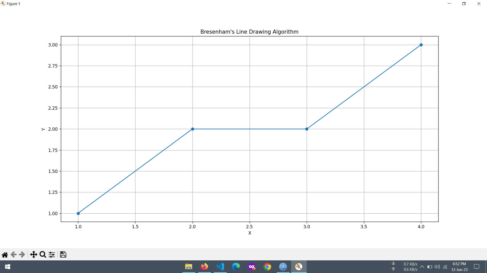

  

# Computer Graphics LAB

Welcome to the Computer Graphics LAB repository! This repository contains a collection of Python code, exercises, and resources related to Computer Graphics, implemented by Md. Rahim.

  

## Table of Contents

- [Introduction](#introduction)
- [Algorithms](#algorithms)
- [Exercises](#exercises)
- [Resources](#resources)
- [Contributing](#contributing)
- [License](#license)

## Introduction

Computer Graphics LAB is a repository created to support your learning and experimentation with computer graphics algorithms. Whether you are a student, a developer, or a graphics enthusiast, this repository provides you with a hands-on approach to explore and implement various computer graphics concepts.

## Algorithms

This repository includes implementations of several computer graphics algorithms, including:

- DDA Algorithm
- Bresenham's Line Algorithm
- Midpoint Circle Algorithm
- Scanline Polygon Fill Algorithm
- ...and more!

You can find the code for these algorithms in their respective files in the [algorithms](algorithms) directory.

## Exercises

The [exercises](exercises) directory contains a set of exercises and assignments to help you practice and deepen your understanding of computer graphics. Each exercise comes with a description and code template for you to complete. Feel free to explore, solve the exercises, and compare your solutions.

## Resources

In the [resources](resources) directory, you will find additional resources, tutorials, and references related to computer graphics. These resources cover a wide range of topics, including introductory concepts, advanced techniques, and practical applications. They serve as valuable references to enhance your knowledge and explore new areas in computer graphics.

## Contributing

Contributions to this repository are highly appreciated! If you have an algorithm implementation, exercise, or resource that you would like to contribute, please follow these steps:

1. Fork this repository.
2. Create a new branch: `git checkout -b feature/new-algorithm`.
3. Make your modifications and additions.
4. Commit your changes: `git commit -am 'Add new algorithm implementation'`.
5. Push to the branch: `git push origin feature/new-algorithm`.
6. Submit a pull request.

Your contributions help improve this repository and benefit the community. Thank you for your valuable input!

## License

This repository is licensed under the [MIT License](LICENSE). You are free to use, modify, and distribute the code and resources in this repository for personal and commercial purposes. Please see the [LICENSE](LICENSE) file for more details.

---

  Made with ❤️ by Md. Rahim

